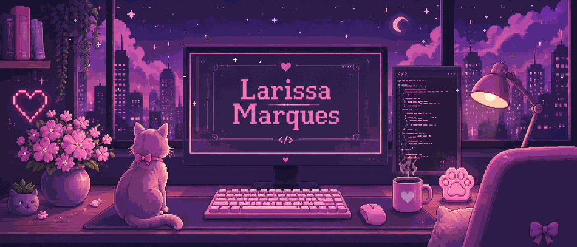

<div align="center">



<br><br>


</div>

---

# 👩🏻‍💻 Olá, eu sou a Larissa

### 🎓 Estudante de Ciência da Computação • Desenvolvedora em formação • Tecnologia com criatividade

<div align="center">


</div>

---

# 🧑🏻‍💻 About Me

```yaml
Nome: Larissa Marques
Usuário: larawrld

Formação:
  - Ciência da Computação
  - Análise e Desenvolvimento de Sistemas

Foco:
  - Desenvolvimento Web
  - Banco de Dados
  - Programação

Atualmente:
  - Desenvolvendo projetos
  - Aprendendo novas tecnologias
  - Evoluindo na área tech 🚀
```

💜 Sou apaixonada por tecnologia e estou construindo minha jornada na programação.

Atualmente desenvolvo projetos acadêmicos e pessoais para fortalecer minhas habilidades em **Desenvolvimento Web**, **Banco de Dados** e **Programação**, unindo criatividade e tecnologia.
Sempre em busca de evolução e novos conhecimentos!

---

# 🛠️ Tech Stack

<table>
<tr>

<td width="70%">


</td>

<td width="30%" align="center">


</td>

</tr>
</table>

---

- 📚 Projetos acadêmicos
- 🌐 Desenvolvimento Web (Front-end e Back-end)
- 🗄️ Banco de Dados
- 🐍 Python
- 📊 SQL
- 💡 Aprender algo novo todos os dias

---

# 📊 GitHub Stats

<div align="center">


</div>

---

# 🌷 Onde me encontrar

<div align="center">

<a href="https://github.com/larawrld">

</a>

<a href="https://www.linkedin.com/in/SEU-LINK">

</a>

<a href="mailto:SEUEMAIL@EMAIL.COM">

</a>

</div>

---

<div align="center">

✨ Obrigada por visitar meu perfil! ✨

<br><br>


</div>
